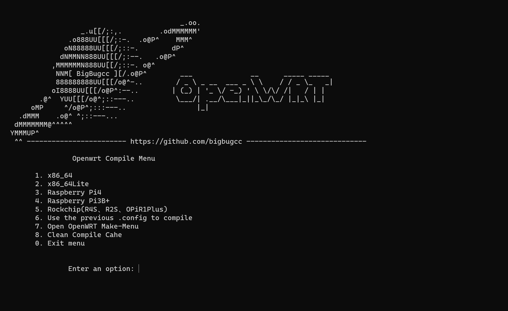

# Lean大openwrt 全自动编译脚本
(lean大默认的插件库已经移除了很多好用的app插件，需要的要手动添加到Package目录下)
1. 自动下载openwrt依赖和源码
2. 自动添加固件中常用的插件
3. 自动编译固件
4. 自动替换Openwrt的Them   
5. 已经加载好配置模板一键编译多版本固件
6. 自带更新脚本`make.sh`方便管理
7. 自带两种编译配置方案(简洁和常用插件版)

---
## 脚本控制台


## 使用
👉 [WSL编译教程 RPi4](https://bughero.net/archives/rpi4_s3.html)   
- 编译脚本引用[Openwrts](https://github.com/bigbugcc/OpenWrts/tree/main/configs)中的配置
```
# 请不要在root用户下执行！！！
sudo mkdir -p /workdir && cd /workdir

# 设置文件用户组
sudo chown $USER:$GROUPS /workdir

# 执行权限
chmod +x ./openwrtinstall.sh
./openwrtinstall.sh

# 二次运行直接进入lede目录
./make.sh
```

## 菜单说明
1. x86_64
2. Raspberry Pi4
3. Raspberry Pi3B+
4. Rockchip(R68S、R2S、R4S、R5C、R5S、OPiR1Plus)
5. Use the previous .config to compile  (使用当前配置文件编译)
6. Open OpenWRT Make-Menu               (打开OpenWRT配置菜单)
7. Clean Compile Cahe                   (清除OpenWRT编译缓存)

## 固件支持
x86   
x86Lite  
NanoPi R4S   
NanoPi R2S   
FastRhino R68S   
FriendlyARM NanoPi R5C | R5S   
Raspberry Pi3 B+   
Raspberry Pi4    
Orange Pi R1 Plus  
---

## 插件
- PassWall / SSR Plus
- AdGuard Home
- Mentohust
- ~~luci-app-vssr~~   
- luci-adbyby-plus
- luci-app-unblockmusic
- luci-app-ddns
- luci-app-pushbot (全能推送)
- luci-app-onliner
- luci-app-ttyd
- luci-app-turboacc
- luci-app-upnp
- luci-app-netdata
- luci-usb-printer
- luci-app-nps
- luci-app-frpc
- luci-app-n2n
- luci-app-syncdial (多播插件)
- luci-app-turboacc
- luci-app-kms  
- luci-app-docker   
- luci-app-serverchan   
- luci-app-control-timewol (定时wol唤醒)   
- luci-app-aliyundrive-webdav (阿里云盘)  
- luci-app-filebrowser   
- luci-app-nfs   

## 二次编译
直接运行lede目录下的make.sh(一键更新openwrt源码及插件库)即可，适合萌新。

## 注意事项
1. 编译过程请务必全程科学上网,如需修改配置文件请make menuconfig   
2. `make.sh`文件每次启动都会自动更新源码以及所有的插件
(自行添加的插件需放入`package\otherapp`目录下)
